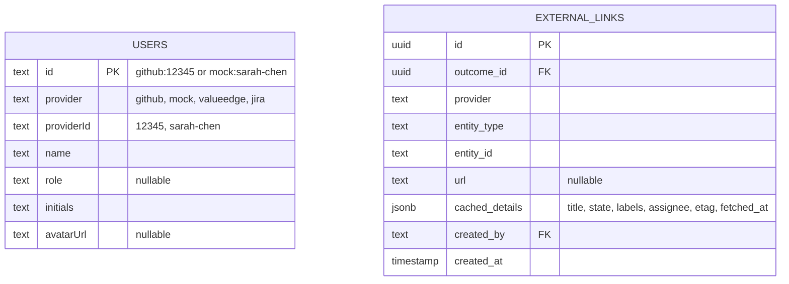

# GitHub OAuth Integration

## Overview

Replace mock auth with GitHub OAuth for GitHub-configured deployments. Validate linked issues via GitHub API, display issue details inline (title, status, labels, assignee), and refresh periodically. Include developer docs for building new provider integrations and user docs for activating GitHub.

## Origin

**Requirements:** [docs/brainstorms/2026-04-06-github-integration-requirements.md](../brainstorms/2026-04-06-github-integration-requirements.md)

Key decisions carried forward:
- GitHub OAuth (per-user tokens, not PAT) — see origin R1
- Signed/encrypted cookie session via `iron-session` — see origin R3
- Container config via env vars — see origin R4
- Provider-agnostic user identity (`provider` + `providerId`) — see origin R2
- Read-only first (no write ops, no webhooks) — see origin scope boundaries

## Technical Approach

### Architecture

```
User → moou frontend → /auth/github (redirect to GitHub)
                      → GitHub OAuth authorize
                      → /auth/callback (exchange code for token)
                      → iron-session cookie set
                      → /api/me (returns user from cookie)
                      → /api/* (all requests authenticated via cookie)

Link creation → /api/outcomes/:id/external-links
             → GitHub API: GET /repos/{owner}/{repo}/issues/{number}
             → Validate exists, cache details as JSONB on external_links row
             → Display inline in OutcomeDetail

Periodic refresh → node-cron or on-page-load if stale (>15 min)
                → Conditional request with ETag (304 = free, no rate limit cost)
```

### Key Libraries

| Library | Version | Purpose |
|---------|---------|---------|
| `iron-session` | ^8.0.0 | Encrypted cookie sessions (AES-256-CBC + HMAC-SHA-256) |
| `octokit` | ^4.0.0 | GitHub REST API client (typed, handles auth headers) |

### Schema Changes



**Users table changes:**
- Add `provider` column (text, not null, default 'mock')
- Add `providerId` column (text, not null)
- Add `avatarUrl` column (text, nullable)
- Change `role` to nullable (GitHub users won't have a role initially)
- Change PK format from `sarah-chen` to `github:12345` or `mock:sarah-chen`
- Existing mock users get `provider: 'mock'`, `providerId: 'sarah-chen'`

**External links table changes:**
- Add `cached_details` JSONB column (nullable) for storing fetched issue metadata

---

## Implementation Phases

### Phase 1: Auth Infrastructure

Backend auth routes + session management. No UI changes yet — test with curl.

- [ ] Install `iron-session` in api/
- [ ] Add env vars: `SESSION_SECRET`, `GITHUB_CLIENT_ID`, `GITHUB_CLIENT_SECRET`, `GITHUB_CALLBACK_URL`, `GITHUB_REPO`
- [ ] Create `api/src/auth/github.ts` — OAuth routes:
  - `GET /auth/github` — Generate `state` param (CSRF), store in cookie, redirect to `https://github.com/login/oauth/authorize?client_id=...&scope=repo read:user user:email&state=...&redirect_uri=...`
  - `GET /auth/callback` — Validate `state`, exchange `code` for access token via `POST https://github.com/login/oauth/access_token`, fetch user profile via `GET https://api.github.com/user`, upsert user in DB (`provider: 'github'`, `providerId: github_user_id`), create iron-session cookie, redirect to `/`
  - `GET /api/me` — Return current user from session (or 401)
  - `POST /auth/logout` — Destroy session cookie, redirect to `/`
- [ ] Create `api/src/auth/session.ts` — iron-session config and helpers
- [ ] Update `api/src/middleware/auth.ts` — Dual-mode auth:
  - If `EXTERNAL_PROVIDER=github`: read user from iron-session cookie. No cookie → redirect to `/auth/github` for non-API requests, 401 for API requests.
  - If `EXTERNAL_PROVIDER` is not `github` (or unset): keep existing `X-User-Id` header mock auth.
  - GET requests still work without auth for shareable URLs.
- [ ] Mount auth routes BEFORE the auth middleware in `app.ts`
- [ ] Update users table schema: add `provider`, `providerId`, `avatarUrl` columns
- [ ] Migrate seed data: existing mock users get `provider: 'mock'`, `providerId` = current ID
- [ ] Update all `createdBy` references to use new user ID format
- [ ] Tests: OAuth redirect, callback token exchange (mocked), session creation, `/api/me`, dual-mode auth switching

**Done when:** `curl /auth/github` redirects to GitHub, callback creates session, `/api/me` returns user, mock auth still works when `EXTERNAL_PROVIDER=valueedge`.

### Phase 2: GitHub API Client + Link Validation

Fetch and cache issue details when creating external links.

- [ ] Install `octokit` in api/
- [ ] Create `api/src/github/client.ts` — GitHub API wrapper:
  - `getIssue(token, owner, repo, number)` — Fetch issue details, return typed object
  - `getPullRequest(token, owner, repo, number)` — Fetch PR details
  - Parse `GITHUB_REPO` env var into owner/repo
  - Handle 404 (not found), 403 (no access), rate limit headers
- [ ] Add `cached_details` JSONB column to `external_links` schema
- [ ] Update `POST /api/outcomes/:id/external-links`:
  - If provider is `github` and user has a session token:
    - Parse entity number from `entityId` or URL
    - Call GitHub API to validate issue/PR exists
    - If not found → 400 with "Issue #X not found in {repo}"
    - If found → store `cached_details` with title, state, labels, assignee, html_url, etag, fetched_at
  - If provider is not `github` → existing behaviour (no validation)
- [ ] Create `api/src/github/refresh.ts` — Refresh cached details:
  - `refreshLink(linkId)` — Fetch issue with `If-None-Match: etag`, update cache if changed
  - `refreshStaleLinks()` — Find links where `fetched_at` is older than 15 minutes, refresh each
- [ ] Wire `refreshStaleLinks()` into the daily cron job (or a more frequent 15-min interval)
- [ ] Tests: Issue fetch (mocked octokit), link validation (rejects non-existent), cache storage, conditional refresh (304 handling)

**Done when:** Creating a link to a real GitHub issue validates it, stores the title/status, and a refresh updates the cache.

### Phase 3: Frontend — Login Flow + Issue Display

Replace mock auth with GitHub login, display cached issue details.

- [ ] Update `app/src/App.vue`:
  - On mount: call `GET /api/me`. If 401, redirect to `/auth/github` (for GitHub provider) or show mock user switcher (for other providers)
  - If authenticated: display GitHub avatar + name in topbar, with logout option
  - If mock mode: keep existing user switcher dropdown
- [ ] Update `app/src/composables/useApi.ts`:
  - Remove `X-User-Id` header logic for GitHub mode (cookie handles auth)
  - Keep header logic for mock mode
  - Add `getMe()` and `logout()` methods
- [ ] Update `app/src/components/OutcomeDetail.vue` — External links display:
  - If `cached_details` exists on a link, show: title, status badge (open/closed/merged), labels as coloured chips, assignee avatar + name
  - If no cached details, show existing raw display (entity type + ID + URL)
  - "Refresh" button to manually trigger a cache update
- [ ] Add login page/redirect: simple "Sign in with GitHub" button that links to `/auth/github`
- [ ] Tests: Login flow mock, user display, issue details rendering

**Done when:** User signs in via GitHub, sees their avatar, linked issues show title + status + labels inline.

### Phase 4: Documentation

- [ ] Create `docs/INTEGRATIONS.md` — Developer guide:
  - Provider integration architecture overview
  - How to add a new provider: auth module, API client, entity types
  - Interface each provider module must implement
  - Example: walking through the GitHub integration code
  - Testing strategy for provider integrations
- [ ] Create `docs/GITHUB-SETUP.md` — User guide:
  - Creating a GitHub OAuth App (step-by-step with screenshots/links)
  - Required env vars and what they mean
  - Docker deployment with GitHub auth
  - Troubleshooting (callback URL mismatch, scope issues, private repo access)
- [ ] Update `README.md` — Add GitHub integration section, link to setup guide
- [ ] Update `docs/DECISIONS.md` — ADR-014 for GitHub OAuth over PAT, iron-session choice
- [ ] Update `docs/SPEC.md` — Auth section updated for GitHub OAuth
- [ ] Tests for docs: verify all env vars mentioned in docs match code

---

## Acceptance Criteria

### Functional (from origin R1-R7)

- [ ] User can sign in via GitHub OAuth and see their name + avatar in topbar
- [ ] Signing out clears session and returns to login screen
- [ ] Mock auth still works for local development without GitHub config
- [ ] Linking a GitHub issue validates it exists via API (rejects non-existent issues)
- [ ] Linked issues show title, status (open/closed/merged), labels, assignee inline
- [ ] Cached issue details refresh automatically when stale (>15 min)
- [ ] A closed issue in GitHub shows as "closed" in moou without manual action
- [ ] Container starts with GitHub config via env vars only

### Documentation (from origin R8-R9)

- [ ] Developer can read INTEGRATIONS.md and understand how to add a Jira integration
- [ ] User can follow GITHUB-SETUP.md to configure GitHub auth from scratch

### Non-Functional

- [ ] GitHub API rate limits respected (5000/hr, ETag conditional requests)
- [ ] Session cookie is encrypted (not just signed)
- [ ] OAuth state param prevents CSRF
- [ ] Existing tests still pass (mock auth backward compatible)

---

## Dependencies & Risks

| Risk | Mitigation |
|------|------------|
| `repo` scope is broad (full read/write) | Document this clearly in user guide. GitHub OAuth Apps don't offer read-only private repo scopes. |
| Cookie size limit (~4KB) | Store only token + minimal user profile. Don't cache large objects in cookie. |
| GitHub API rate limits | ETag conditional requests (304 = free). 5000/hr is plenty for a small team. Monitor via response headers. |
| Schema migration (users table PK change) | Use `drizzle-kit push` in dev. For production, plan a careful migration of existing FK references. |
| iron-session v8 API changes | Pin to exact version. The v8 API is stable (single function). |

## Sources

- **Origin:** [docs/brainstorms/2026-04-06-github-integration-requirements.md](../brainstorms/2026-04-06-github-integration-requirements.md)
- **GitHub OAuth Docs:** https://docs.github.com/en/apps/oauth-apps/building-oauth-apps/authorizing-oauth-apps
- **GitHub Scopes:** https://docs.github.com/en/apps/oauth-apps/building-oauth-apps/scopes-for-oauth-apps
- **GitHub Issues API:** https://docs.github.com/en/rest/issues/issues
- **iron-session v8:** https://github.com/vvo/iron-session
- **ETag/Conditional Requests:** https://docs.github.com/rest/guides/best-practices-for-using-the-rest-api
- **Existing provider code:** api/src/providers.ts
- **Existing auth:** api/src/middleware/auth.ts
- **Existing external links:** api/src/routes/outcomes.ts (lines 248-286)
